# CoreBaseApplication (CBA)

<div align="center">


[](https://github.com/seregonwar/CoreBaseApplication-CBA/actions)
[](LICENSE)
[](https://github.com/seregonwar/CoreBaseApplication-CBA/releases)
[](https://seregonwar.github.io/CoreBaseApplication)
[]()

**A modern, robust C++ framework for building scalable enterprise applications**

[📚 Documentation](https://seregonwar.github.io/CoreBaseApplication-CBA) • [🚀 Quick Start](#quick-start) • [💡 Examples](docs/examples/) • [🤝 Contributing](#contributing)

</div>

## Overview

CoreBaseApplication (CBA) is a comprehensive C++ framework designed for developing high-performance, scalable enterprise applications. It provides a modular architecture with integrated components for advanced logging, configuration management, system monitoring, networking, and more.

### Key Features

- 🏗️ **Modular Architecture** - Clean, extensible design with loosely coupled components
- 📝 **Advanced Logging** - Multi-appender system with rotation, compression, and structured logging
- ⚙️ **Configuration Management** - JSON/YAML support with hot reload and validation
- 📊 **System Monitoring** - Real-time metrics, health checks, and performance counters
- 🌐 **Networking** - HTTP/HTTPS client, WebSocket support, and REST utilities
- 🔒 **Security** - Built-in security features and best practices
- 🚀 **Performance** - Optimized for high-throughput applications
- 🐳 **Container Ready** - Docker and Kubernetes deployment support

## Quick Start

### Prerequisites

- **Compiler**: GCC 9+, Clang 10+, or MSVC 2019+
- **C++ Standard**: C++17 or higher
- **CMake**: 3.15 or higher
- **Dependencies**: OpenSSL, libcurl, nlohmann/json

### Installation

```bash
# Clone the repository
git clone https://github.com/seregonwar/CoreBaseApplication-CBA.git
cd CoreBaseApplication-CBA

# Build and install
mkdir build && cd build
cmake .. -DCMAKE_BUILD_TYPE=Release
make -j$(nproc)
sudo make install
```

### Basic Usage

```cpp
#include "CoreAPI.h"

int main() {
    // Initialize the framework
    CoreAPI::initialize("config/app.json");
    
    // Get logger instance
    auto logger = CoreAPI::getLogger();
    logger->info("Application started successfully");
    
    // Your application logic here
    // ...
    
    // Clean shutdown
    CoreAPI::shutdown();
    return 0;
}
```

## Documentation

Comprehensive documentation is available at **[https://seregonwar.github.io/CoreBaseApplication-CBA](https://seregonwar.github.io/CoreBaseApplication-CBA)**

### 📖 Getting Started
- [Quick Start Guide](docs/getting-started/quick-start.md)
- [Installation Instructions](docs/getting-started/installation.md)
- [Basic Configuration](docs/getting-started/configuration.md)

### 🏗️ Architecture
- [System Overview](docs/architecture/overview.md)
- [Core Components](docs/architecture/components.md)
- [Design Patterns](docs/architecture/patterns.md)

### 🔧 Core Modules
- [CoreAPI](docs/modules/core-api.md) - Central entry point and framework initialization
- [Logging System](docs/modules/logging.md) - Advanced logging with multiple appenders
- [Configuration Management](docs/modules/configuration.md) - JSON/YAML configuration with validation
- [System Monitoring](docs/modules/monitoring.md) - Metrics, health checks, and alerting
- [Network Management](docs/modules/networking.md) - HTTP client, WebSocket, and REST utilities

### 💻 Development
- [Development Setup](docs/development/setup.md)
- [Best Practices](docs/development/best-practices.md)
- [Performance Guidelines](docs/development/performance.md)
- [Security Guidelines](docs/development/security.md)

### 📋 API Reference
- [Complete API Documentation](docs/api/reference.md)
- [Class Hierarchy](docs/api/classes.md)
- [Function Reference](docs/api/functions.md)

### 💡 Examples
- [Basic Usage Examples](docs/examples/basic-usage.md)
- [Advanced Patterns](docs/examples/advanced-usage.md)
- [Real-world Applications](docs/examples/applications.md)

### 🔗 Language Bindings
- [Python Integration](docs/bindings/python.md)
- [Node.js Bindings](docs/bindings/nodejs.md)
- [C# Wrapper](docs/bindings/csharp.md)

### 🚀 Deployment
- [Production Deployment](docs/deployment/production.md)
- [Docker Configuration](docs/deployment/docker.md)
- [Kubernetes Setup](docs/deployment/kubernetes.md)

## Architecture Overview

```mermaid
graph TB
    A["🚀 CoreAPI<br/>Entry Point"] --> B["⚙️ ConfigManager<br/>Configuration"]
    A --> C["📝 Logger<br/>Logging System"]
    A --> D["📊 SystemMonitor<br/>Monitoring"]
    A --> E["🌐 NetworkManager<br/>HTTP/WebSocket"]
    
    B --> F["📄 JSON/YAML<br/>Config Files"]
    C --> G["📁 File Appenders<br/>Log Rotation"]
    C --> H["🖥️ Console<br/>Colored Output"]
    D --> I["💻 CPU/Memory<br/>Metrics"]
    D --> J["🔍 Health Checks<br/>Alerts"]
    E --> K["🔗 HTTP Client<br/>REST APIs"]
    E --> L["⚡ WebSocket<br/>Real-time"]
    
    style A fill:#e1f5fe
    style B fill:#f3e5f5
    style C fill:#e8f5e8
    style D fill:#fff3e0
    style E fill:#fce4ec
```



## Use Cases

CBA is perfect for:

- **Web APIs and Microservices** - RESTful services with built-in monitoring
- **Enterprise Applications** - Large-scale business applications
- **Real-time Systems** - WebSocket-based real-time communication
- **Data Processing Pipelines** - High-throughput data processing
- **IoT Backends** - Device management and data collection
- **Financial Systems** - High-performance trading and analytics

## Community and Support

- 📖 **Documentation**: [https://seregonwar.github.io/CoreBaseApplication-CBA](https://seregonwar.github.io/CoreBaseApplication-CBA)
- 💬 **Discord Community**: [Join our Discord](https://discord.gg/cba-community)
- 🐛 **Bug Reports**: [GitHub Issues](https://github.com/seregonwar/CoreBaseApplication-CBA/issues)
- 💡 **Feature Requests**: [GitHub Discussions](https://github.com/seregonwar/CoreBaseApplication-CBA/discussions)
- 📧 **Email Support**: support@corebaseapp.com

## Contributing

We welcome contributions! Please see our [Contributing Guidelines](CONTRIBUTING.md) for details on:

- Code of Conduct
- Development Process
- Pull Request Guidelines
- Coding Standards

## License

This project is licensed under the MIT License - see the [LICENSE](LICENSE) file for details.

## Acknowledgments

- Built with modern C++ best practices
- Inspired by enterprise-grade frameworks
- Community-driven development
- Extensive testing and documentation

---

<div align="center">

**[⭐ Star us on GitHub](https://github.com/seregonwar/CoreBaseApplication-CBA) • [📖 Read the Docs](https://seregonwar.github.io/CoreBaseApplication-CBA) • [🤝 Join the Community](https://discord.gg/cba-community)**

Made with ❤️ by the CBA Team

</div>
