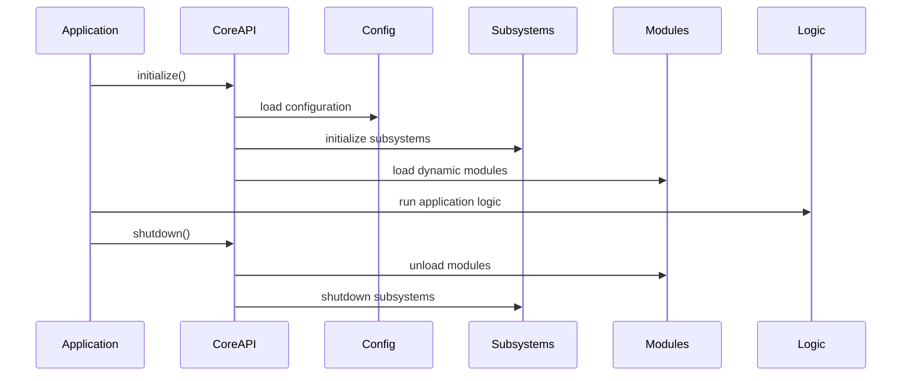

# Framework Architecture

CoreBaseApplication is built around a modular architecture that provides a solid foundation for enterprise applications and complex systems.

## Core Principles

- **Modularity**: Components are loosely coupled and can be used independently
- **Extensibility**: Easy to extend with custom modules and plugins
- **Performance**: Optimized for high-performance applications
- **Security**: Built-in security features and best practices
- **Maintainability**: Clean code architecture following SOLID principles

## Architecture Overview

```mermaid
graph TD
    A[CoreBaseApplication] --> B[CoreAPI]
    A --> C[AdvancedLogging]
    A --> D[Monitoring]
    A --> E[Security]
    A --> F[Extensions]
    A --> G[DynamicModules]
    
    B -->|Manages| H[Configuration]
    B -->|Coordinates| I[Module Loading]
    
    C --> J[RotatingLogger]
    C --> K[LogAppenders]
    C --> L[LogLevels]
    
    D --> M[MonitoringSystem]
    D --> N[EventTracker]
    D --> O[Performance Reports]
    
    E --> P[AuthenticationManager]
    E --> Q[CodeProtection]
    E --> R[Encryption]
    
    F --> S[EventSystem]
    F --> T[NetworkManager]
    F --> U[Utilities]
    
    G --> V[ModuleLoader]
    G --> W[ModuleInterface]
    
    style A fill:#2ecc71,stroke:#27ae60,stroke-width:2px,color:white
    style B fill:#3498db,stroke:#2980b9
    style C fill:#e74c3c,stroke:#c0392b
    style D fill:#9b59b6,stroke:#8e44ad
    style E fill:#f39c12,stroke:#d35400
    style F fill:#1abc9c,stroke:#16a085
    style G fill:#34495e,stroke:#2c3e50,color:white
```



## Project Structure

```
CoreBaseApplication/
├── src/
│   ├── core/                   # Framework core
│   │   ├── CoreAPI.h           # Main Core interface
│   │   ├── CoreAPI.cpp         # Core implementation
│   │   ├── AdvancedLogging/    # Advanced logging system
│   │   ├── CoreClass/          # Fundamental classes
│   │   ├── DynamicModules/     # Dynamic module management
│   │   ├── Extensions/         # Extensions and utilities
│   │   ├── Monitoring/         # Monitoring system
│   │   ├── Patterns/           # Design pattern implementations
│   │   ├── Security/           # Security features
│   │   └── bindings/           # Language bindings
│   ├── apps/                   # Sample applications
│   └── modules/                # Sample modules
├── docs/                       # Documentation
├── examples/                   # Example projects
├── third_party/                # Third-party dependencies
└── tests/                      # Test suites
```

## Execution Flow



## Key Components

### 1. CoreAPI
The central orchestrator that manages all framework components and provides the main interface for applications.

### 2. Configuration Management
Flexible JSON-based configuration system with support for nested configurations and runtime updates.

### 3. Logging System
Advanced logging with multiple appenders, log rotation, compression, and configurable formatting.

### 4. Monitoring & Analytics
Comprehensive monitoring system for performance tracking, event logging, and system diagnostics.

### 5. Security Framework
Built-in authentication, authorization, encryption, and code protection mechanisms.

### 6. Module System
Dynamic module loading system that allows runtime extension of functionality.

### 7. Event System
Publish-subscribe event system for loose coupling between components.

### 8. Network Management
High-level networking abstractions supporting multiple protocols and connection types.

## Design Patterns Used

- **Singleton**: For system-wide services (Logger, ConfigManager, etc.)
- **Factory**: For creating appenders, modules, and other components
- **Observer**: For event system and monitoring
- **Strategy**: For different authentication methods and logging strategies
- **Facade**: CoreAPI provides a simplified interface to complex subsystems
- **Template Method**: For module lifecycle management

## Thread Safety

The framework is designed with thread safety in mind:

- All singleton instances are thread-safe
- Logging system supports concurrent access
- Configuration updates are atomic
- Event system handles concurrent publishers and subscribers

## Performance Considerations

- Minimal overhead initialization
- Lazy loading of optional components
- Efficient memory management
- Optimized logging with buffering
- Lock-free data structures where possible

## Next Steps

- [Explore Core Components](core-components.md)
- [Learn about Design Patterns](design-patterns.md)
- [Understand the Module System](module-system.md)